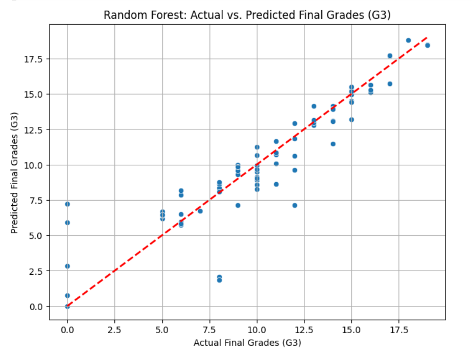
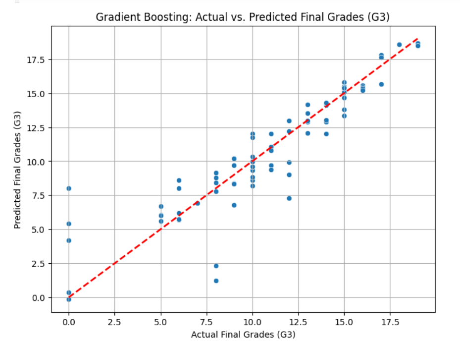
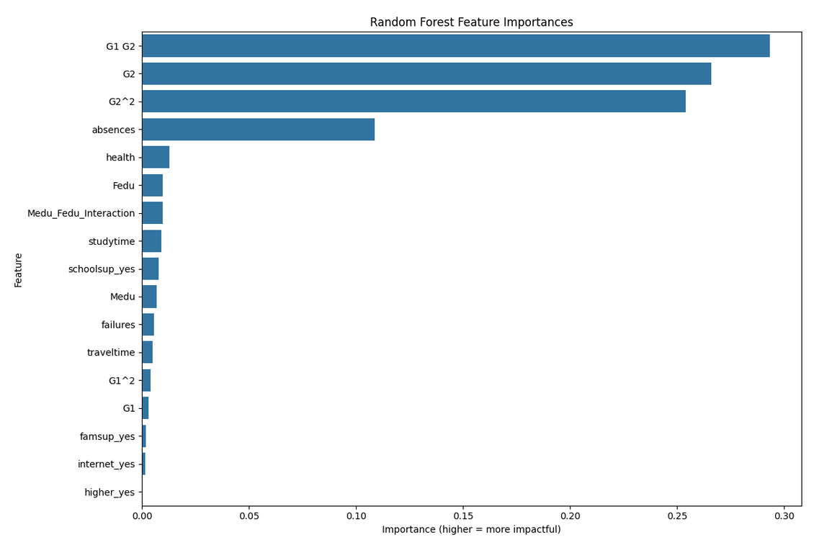

# Student Performance Prediction ML

## Project Overview

This project aims to predict students' final grades (**G3**) based on their past academic performance, attendance, and socio-economic factors. I analyzed the dataset and compared three machine learning models to find the most accurate predictor.

## Key Results

I trained and evaluated three models. The **Random Forest Regressor** outperformed others with the following metrics:

- **R-squared:** 0.84 (The model explains 84% of the variance).
- **MAE:** 1.12
- **MSE:** 3.32
- **RMSE:** 1.82

  
   
  <em>Figure 1: Actual vs. Predicted Grades using Linear Regression</em>

 

  
   
  <em>Figure 2: Actual vs. Predicted Grades using Random Forest</em>

 

  
   
  <em>Figure 3: Actual vs. Predicted Grades using Gradient Boosting</em>

## Key Insights

Based on the Feature Importance analysis:

1.  **Past Grades (G1 & G2):** These are the strongest predictors of the final grade.
2.  **Absences:** A crucial factor; high absences strongly correlate with lower grades.
3.  **Zero Grades Anomaly:** I identified that a grade of '0' acts as an outlier, likely indicating a missed exam rather than low academic ability.

 

  
   
  <em>Figure 4: Feature Importance Plot for Random Forest Model</em>

## Tools & Libraries Used

- **Python** (Pandas, NumPy)
- **Visualization:** Matplotlib, Seaborn
- **Machine Learning:** Scikit-Learn (Linear Regression, Random Forest, Gradient Boosting)

## How to Run

1. Clone the repository.
2. Install the required libraries.
3. Run the `student_performance_prediction.ipynb` notebook.
